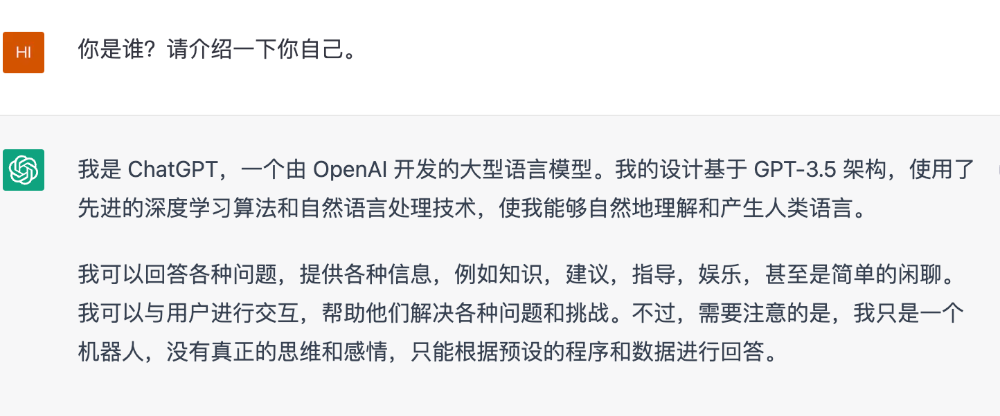
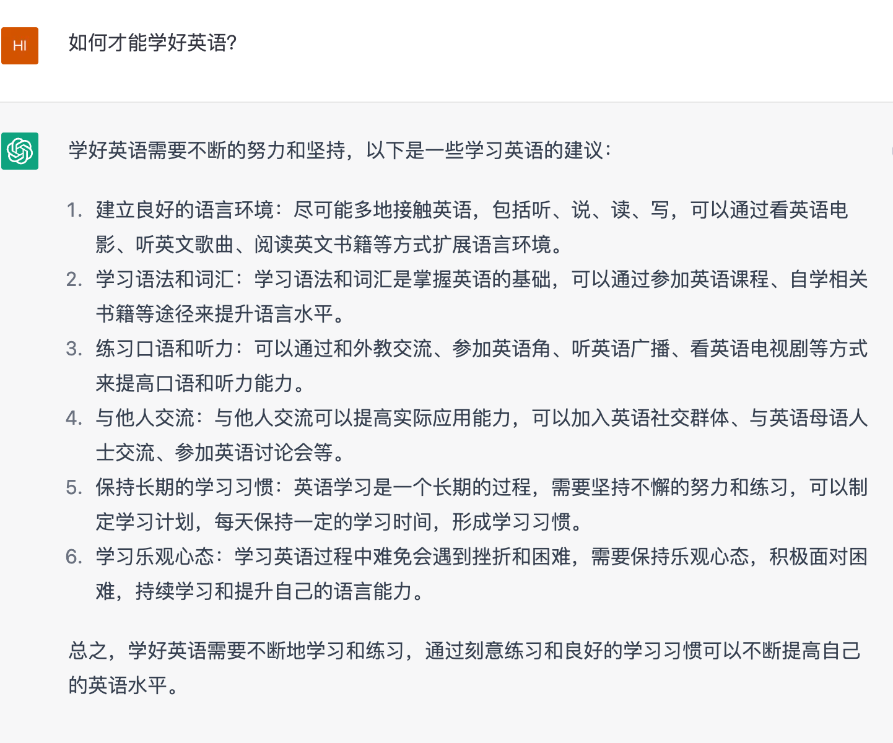
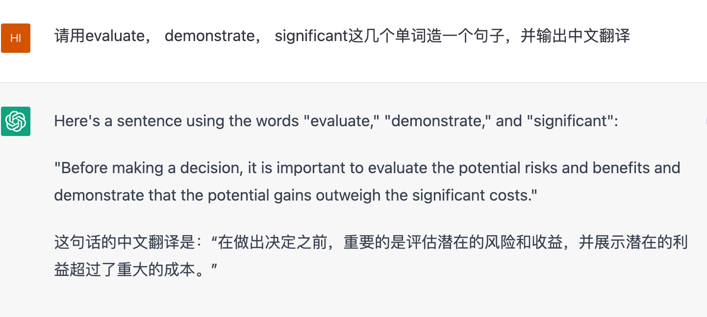
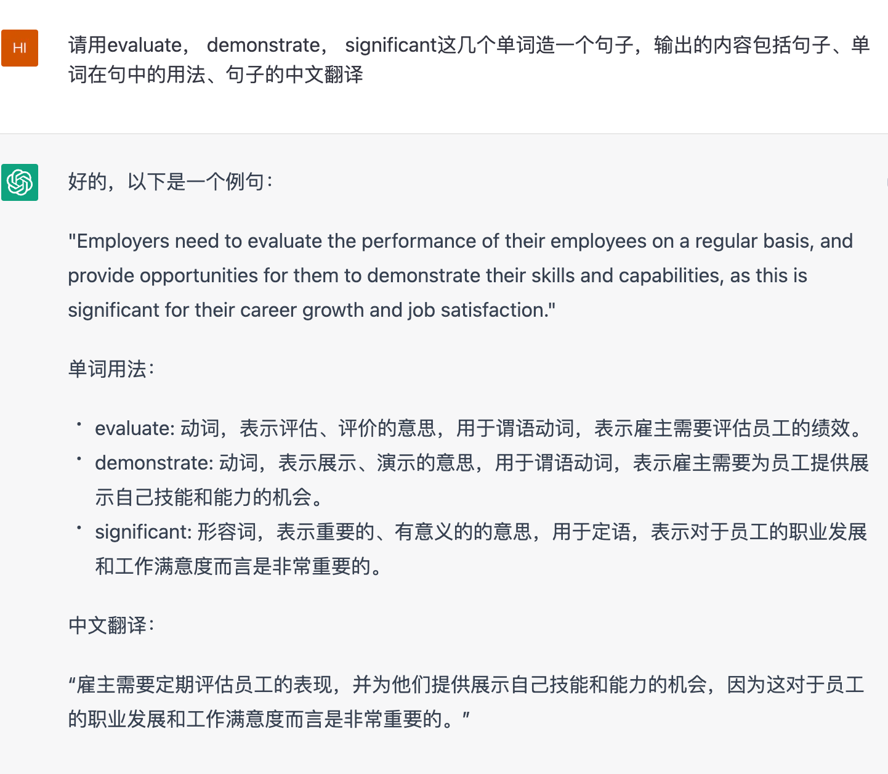
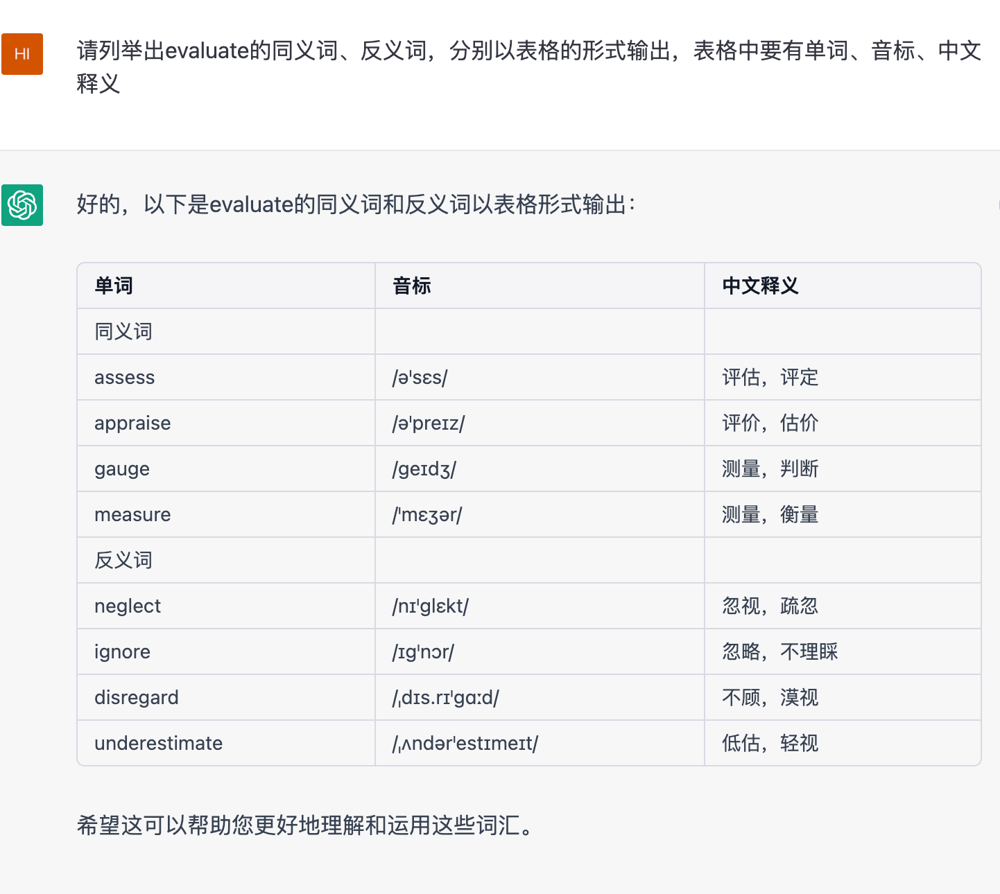
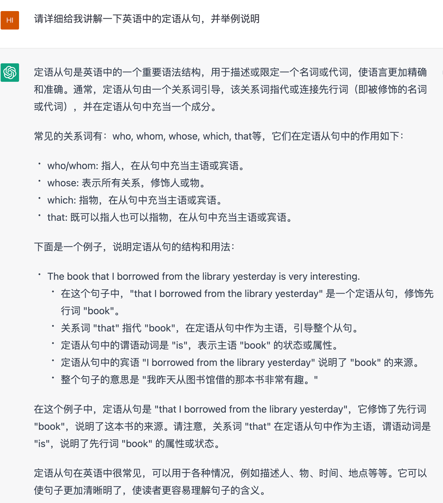
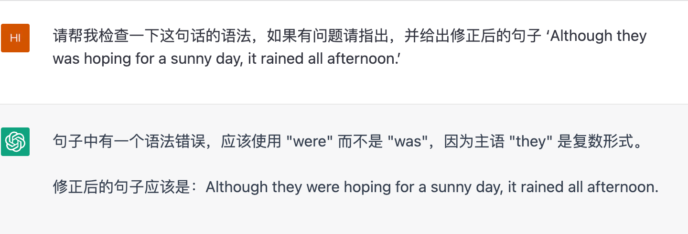
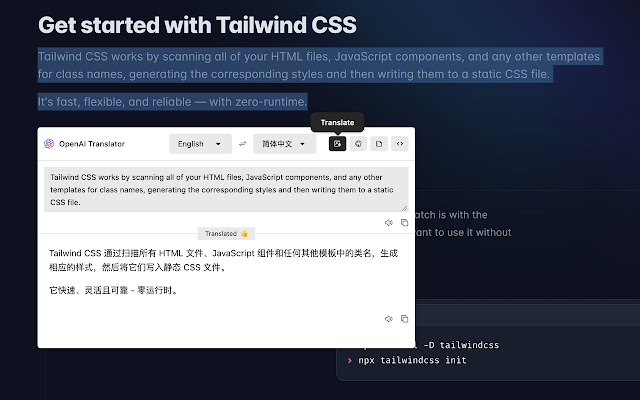
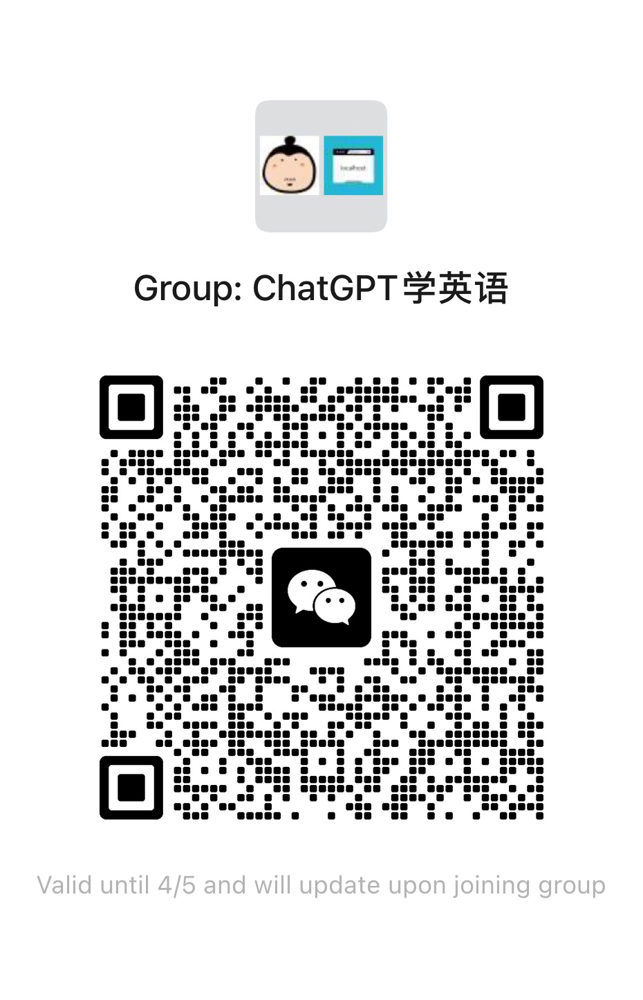

00

## 1.什么是 ChatGPT

* **维基百科**

> ChatGPT，全称聊天生成预训练转换器（英语：Chat Generative Pre-trained Transformer），是OpenAI开发的人工智能聊天机器人程序，于2022年11月推出。该程序使用基于GPT-3.5架构的大型语言模型并以强化学习训练。ChatGPT目前仍以文字方式交互，而除了可以用人类自然对话方式来交互，还可以用于甚为复杂的语言工作，包括自动生成文本、自动问答、自动摘要等多种任务。如：在自动文本生成方面，ChatGPT可以根据输入的文本自动生成类似的文本（剧本、歌曲、企划等），在自动问答方面，ChatGPT可以根据输入的问题自动生成答案。还有编写和调试计算机程序的能力。

* **自我介绍**
  
   

简单来说ChatGPT就是一个百科全书似的存在，可以用对话的形式检索到你需要的信息。而对话过程中你发给ChatGPT的内容称之为Prompt。

## 2.如何学英语

------

首先来看看ChatGPT关于`如何学好英语`的回答

是不是感觉说的句句在理🐶

------

下面将从词汇、语法、听力、口语、写作几个方面介绍一下如何利用ChatGPT来帮助我们学习英语

⚠️注：*这里的使用姿势只是很简单的一种，大家可以不断调整优化prompt找到适合自己的玩法*

### 2.1 翻译

------

作为大语言模型，翻译还不是信手拈来～

### 2.2 词汇

------

* 记忆单词

> 请用evaluate， demonstrate， significant这几个单词造一个句子，并输出中文翻译

* 再加一些分析

> 请用evaluate， demonstrate， significant这几个单词造一个句子，输出的内容包括句子、单词在句中的用法、句子的中文翻译

* 查询同义词，反义词

> 请列举出evaluate的同义词、反义词，分别以表格的形式输出，表格中要有单词、音标、中文释义

### 2.3 语法

------

* 直接学习某种语法：
  
  > 请详细给我讲解一下英语中的定语从句，并举例说明

* 检查语法并指出问题与修正
  
  > 请帮我检查一下这句话的语法，如果有问题请指出，并给出修正后的句子 ‘Although they was hoping for a sunny day, it rained all afternoon.’

  

## 2.4 口语和听力

---

上面的部分打开聊天窗口直接聊就能完成了，但是练习口语和听力的话就需要一些其他插件的帮助了，这里用到的插件是 [Talk-to-ChatGPT](https://chrome.google.com/webstore/detail/talk-to-chatgpt/hodadfhfagpiemkeoliaelelfbboamlk) 可以点击链接去安装插件。

这部分不能用图片来展现，可以点击下方视频链接查看具体用法

👉 [视频介绍](https://www.youtube.com/watch?v=VXkLQMEs3lA)

### 3.prompts

------

- [awesome-chatgpt-prompts](https://github.com/f/awesome-chatgpt-prompts)
- [ChatGPT Shortcut](https://newzone.top/chatgpt/)\
- [ChatGPT 指令大全](https://www.explainthis.io/zh-hant/chatgpt)
- [ChatGPT 中文调教指南](https://chatguide.plexpt.com/)

### 4.一些工具

------

- [ChatGPT镜像](https://github.com/xx025/carrot) 这儿为你准备了众多免费好用的ChatGPT镜像站点

- [OpenAI Translator](https://www.appinn.com/openai-translator-for-chrome) 基于ChatGPT的划词翻译浏览器插件和桌面端应用(开源)
  
    
  
  [插件下载](https://chrome.google.com/webstore/detail/openai-translator/ogjibjphoadhljaoicdnjnmgokohngcc?hl=zh-CN)    [项目地址](https://github.com/yetone/openai-translator)

### 5.群

------

建了一个学英语的群，希望大家一起学英语，一起打卡，一起进步
如果你有任何疑问，也可以加群一起交流

  

### 6.群

------

以上示例只是使用 ChatGPT 的冰山一角，欢迎通过 issue 或 PR 提交你的玩法，优质资源😊
也欢迎各种贡献，包括修复错误、添加新功能和改进文档
